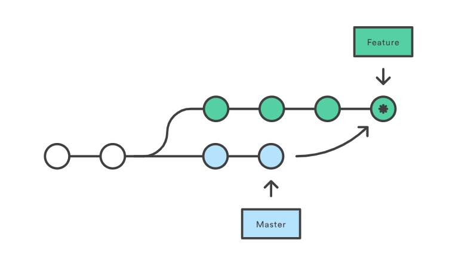
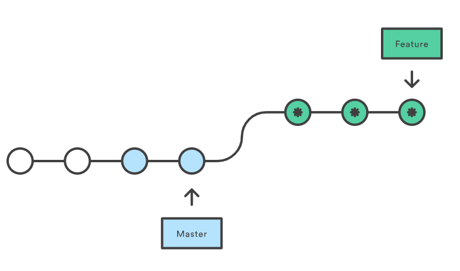

## Git

1. Что такое GitFlow?

<details>
  <summary>Ответ</summary>

GitFlow - модель ветвления Git.

*Ключевые идеи*:
1. Данная модель отлично подходит для организации рабочего процесса на основе релизов,
2. Gitflow предлагает создание отдельной ветки для исправлений ошибок в продуктовой среде.

*Последовательность работы при использовании модели Gitflow*:

1. Из *master* создается ветка *develop*.
2. Из *develop* создаются ветки *feature*.
3. Когда разработка новой функциональности завершена, она объединяется с веткой *develop*.
4. Из *develop* создается ветка *release*.
5. Когда ветка релиза готова, она объединяется с *develop* и *master*.
6. Если в *master* обнаружена проблема, из нее создается ветка *hotfix*.
7. Как только исправление на ветке *hotfix* завершено, она объединяется с *develop* и *master*.

</details>

2. Чем `merge` отличается от `rebase`?

<details>
  <summary>Ответ</summary>

- `git merge` - выполняет слияние коммитов из одной ветки в другую. В этом процессе изменяется только целевая ветка. История исходных веток остается неизменной.

  

  *Преимущества*:
    1. Простота,
    2. Сохраняет полную историю и хронологический порядок,
    3. Поддерживает контекст ветки.

  *Недостатки*:
    1. История коммитов может быть заполнена (загрязнена) множеством коммитов,
    2. Отладка с использованием git bisect может стать сложнее.


- `git rebase` - сжимает все изменения в один патч. Затем интегрирует патч в целевую ветку. В отличии от *merge*, *rebase* перезаписывает историю, потому что она передаётся завершенную работу из одной ветки в другую. В процессе устраняется нежелательная история.

  

  *Преимущества*:
    1. Упрощает потенциально сложную историю,
    2. Упрощение манипуляций с единственным коммитом,
    3. Избежание слияния коммитов в занятых репозиториях и ветках,
    4. Очищает промежуточные коммиты, делая их одним коммитом, что полезно для DevOps команд.

    *Недостатки*:
    1. Сжатие фич до нескольких коммитов может скрыть контекст
    2. Перемещение публичных репозиториев может быть опасным при     работе в команде,
    3. Появляется больше работы,
    4. Для восстановления с удаленными ветками требуется     принудительный пуш. Это приводит к обновлению всех веток, имеющих одно и то же имя, как локально, так и удаленно.

</details>

3. Чем `tag` отличается от `branch`?

<details>
  <summary>Ответ</summary>

И *tag* и *branch* представляют собой указатели на коммиты.
- Ветка представляет собой отдельный поток разработки, который может выполняться одновременно с другими разработками в той же кодовой базе. Коммит в ветке указывает на изменения, которые добавляются в новых коммитах
- Тег представляет собой версию определенной ветки в определенный момент времени.

*Tag* представляет собой версию той или иной ветки в определенный момент времени. *Branch* представляет собой отдельный поток разработки, который может выполнятся одновременно с другими разработками в той же кодовой базе.

</details>

4. В ветке *develop* есть коммит с изменениями, которые нужно перенести в ветку *master*. Как это сделать?

<details>
  <summary>Ответ</summary>

Необходимо найти хеш этого коммита и выполнить следующую комманду в ветке, в которую нужно перенести коммит.
```sh
git cherry-pick <commit_hash>
```

</details>

5. Для чего нужна команда `git commit --amend`?

<details>
  <summary>Ответ</summary>

`commit --ammend` используется для исправления сообщения последнего коммита. Также возможно использовать, чтобы добавить файлы в индекс (`git add`), после добавить файлы в коммит `git commit --ammend`.

</details>

6. Что такое Trunk-based development?

<details>
  <summary>Ответ</summary>

Trunk-based Development (TBD) - модель ветвления, в которой разработчики совместно работают над кодом в одной ветви, называемой "стволом" (trunk). При этом другие ветви имеют короткий срок жизни благодаря использованию документированных методов.

</details>

7. Состояние репозитория ушло на много коммитов вперед. Как откатить весь репозиторий к определенному коммиту?

<details>
  <summary>Ответ</summary>

git reset --hard <tag/branch/commit hash>

</details>

8. В репозиторий запушен коммит с изменениями в двух файлах. Как откатить изменения этого коммита?

<details>
  <summary>Ответ</summary>

git revert <commit hash>
`git revert <commit hash>`

</details>

9. Как переключаться между коммитами?

<details>
  <summary>Ответ</summary>

`git checkout <commit hash>`

</details>

10. Как посмотреть хеш коммитами?

<details>
  <summary>Ответ</summary>

`git status`

</details>

11. Git log?

<details>
  <summary>Ответ</summary>
Отображает историю коммитов.

По умолчанию (без аргументов) git log перечисляет коммиты, сделанные в репозитории в обратном к хронологическому порядке — последние коммиты находятся вверху

</details>

12. Git log  --online --all --graph?

<details>
  <summary>Ответ</summary>

Просмотр всех коммитов во всех ветках (с псевдо-графическими элементами для отображения связей между коммитами)

</details>

13. Если git log не находит коммит?

<details>
  <summary>Ответ</summary>

`git reflog` 

Либо для получения информации в более удобном виде, можно воспользоваться командой `git log -g`

</details>

14. Если помимо коммита удалена история?

<details>
  <summary>Ответ</summary>

`git fsck --full` - проверяет внутреннюю базу данных на целостность. Если выполнить её с ключом --full, будут показаны все объекты, недостижимые из других объектов

</details>

15. git commit . ?

<details>
  <summary>Ответ</summary>

Закоммитить все существующие файлы

</details>

16. git commit -m ?

<details>
  <summary>Ответ</summary>

Добавить коммит с комментарием

</details>

17. Как переключаться между ветками?

<details>
  <summary>Ответ</summary>

`git checkout <имя ветки>`

`git switch` Начиная с Git версии 2.23, вы можете использовать git switch вместо git checkout

</details>

18. git log --oneline?

<details>
  <summary>Ответ</summary>

Параметр oneline выводит каждый коммит в одну строку, что удобно если вы просматриваете большое количество коммитов.

удобнее отображать в альтернативном формате: 

`git log --pretty=oneline`

</details>

19. Как слить ветки между собой?

<details>
  <summary>Ответ</summary>

`git merge <name> -m <name>`

`git merge test -m master`

</details>

20. Как создать ветку?

<details>
  <summary>Ответ</summary>

`git checkout -b <name>`

`git checkout testing `

</details>

21. Как добавить локальный репозиторий в  удаленный ?

<details>
  <summary>Ответ</summary>

`git remote add origin  <url_address> -m <name>`

`git remote add origin https://gitlab.ekdeus.local/ek/test.git`

`git remote add origin https://github.com/ek-deus/test.git`

</details>

22. git remote -v?

<details>
  <summary>Ответ</summary>

Выводит список ваших удаленных подключений к другим репозиториям с URL-адресами.

</details>

23. Как изменить название ветки?

<details>
  <summary>Ответ</summary>

`git push origin  <зазвание ветки которое меням>: <название ветки на которое меняем>`

`git push origin  testtting: testing`

</details>

24. Чем они отличаются ?

    `git fetch origin`

    `git pull origin`
    
    `git push origin`

    `git branch -vv`

<details>
  <summary>Ответ</summary>

git fetch - это получение изменений с сервера

git pull - это шоткод для последовательности двух команд: git fetch (получение изменений с сервера) и git merge (сливание в локальную копию).

git push - передает коммиты из локального репозитория в удаленный.

git branch -vv  Выводит список локальных веток и дополнительную информацию о том, какая из веток отслеживается, отстаёт или опережает

</details>

25. Как склеить несколько комитов в один ?


<details>
  <summary>Ответ</summary>

`git squash`

Основы Git
Как узнать, является ли определённая директория репозиторием Git?

Вы можете проверить, существует ли каталог с расширением ".git".
Объясните следующее: git directory, working directoryиstaging area

Этот ответ взят с сайта git-scm.com.

«В каталоге Git хранятся метаданные и объектная база данных вашего проекта. Это самая важная часть Git, и именно она копируется при клонировании репозитория с другого компьютера».

Рабочая директория представляет собой единый репозиторий одной версии проекта. Эти файлы извлекаются из сжатой базы данных в директории Git и размещаются на диске для вашего использования или изменения.

Область подготовки (staging area) — это простой файл, обычно расположенный в каталоге Git, который хранит информацию о том, что войдет в ваш следующий коммит. Иногда его называют индексом, но сейчас стало общепринятым называть его областью подготовки.

В чём разница между git pullи git fetch?

Короче говоря, git pull = git fetch + git merge

При выполнении команды `git pull` все изменения из удалённого или центрального репозитория прикрепляются к соответствующей ветке в вашем локальном репозитории.

Команда `git fetch` получает все изменения из удалённого репозитория и сохраняет их в отдельной ветке в вашем локальном репозитории.

Как проверить, отслеживается ли файл, и если нет, то как его отследить?

Существуют разные способы проверить, отслеживается ли файл или нет:

git ls-files <file>-> Код завершения 0 означает, что процесс отслеживается.
git blame <file> ...
gitignoreОбъясните, для чего используется этот файл.

Цель использования gitignoreфайлов заключается в обеспечении того, чтобы определенные файлы, не отслеживаемые Git, оставались неотслеживаемыми. Чтобы прекратить отслеживание файла, который в данный момент отслеживается, используйте команду `git rm --cached`.
Как можно увидеть, какие изменения уже внесены, прежде чем их подтвердить?

`git diff`

Что git statusэто?

git statusЭто поможет вам понять статус отслеживания файлов в вашем репозитории. Сосредоточившись на рабочем каталоге и промежуточной области, вы сможете узнать, какие изменения были внесены в рабочий каталог, какие изменения произошли в промежуточной области и, в целом, отслеживаются ли файлы или нет.

Вы создали новые файлы в своем репозитории. Как убедиться, что Git их отслеживает?

git add FILES

Сценарии
У вас в репозитории есть файлы, которые вы не хотите, чтобы Git отслеживал. Что вам следует сделать, чтобы избежать их отслеживания?

Добавьте их в файл .gitignore. Это гарантирует, что эти файлы никогда не будут добавлены в область подготовки.

В вашей организации команда разработчиков использует монорепозиторий, который разросся до огромных размеров и включает сотни тысяч файлов. Они говорят, что выполнение многих операций Git занимает много времени (например, команда `git status`). Почему это происходит и что вы можете сделать, чтобы им помочь?

Многие операции Git связаны с состоянием файловой системы. git statusНапример, Git выполняет сравнение коммитов HEAD и индексов, а также сравнение индексов и рабочих каталогов. В рамках этих сравнений требуется выполнить довольно много lstat()системных вызовов. При обработке сотен тысяч файлов это может занять секунды, если не минуты.

Один из способов решения этой проблемы — использование встроенного fsmonitorмонитора файловой системы Git. С помощью fsmonitor (интегрированного с Watchman) Git запускает демон, который будет постоянно отслеживать любые изменения в рабочем каталоге вашего репозитория и кэшировать их. Таким образом, при запуске git statusвместо сканирования рабочего каталога вы будете использовать кэшированное состояние вашего индекса.


Далее вы можете попробовать включить эту функцию feature.manyFileс помощью команды git config feature.manyFiles true`.`. Это даст два результата:

Настраивает параметры index.version = 4, позволяющие сжимать префиксы путей в индексе.
Этот параметр core.untrackedCache=trueпо умолчанию имеет значение keep. Неотслеживаемый кэш — довольно важная концепция. Он записывает время модификации (mtime) всех файлов и каталогов в рабочем каталоге. Таким образом, при переборе всех файлов и каталогов можно пропустить те, время модификации которых не было обновлено.
Перед включением этой функции рекомендуется выполнить команду git update-index --test-untracked-cacheдля проверки и убедиться, что mtime работает в вашей системе.

В Git также есть встроенная команда, которая оптимизирует репозиторий Git, благодаря чему команды, такие как `git` или `git` , git-maintainenceвыполняются быстрее, а также репозиторий Git занимает меньше места на диске. Рекомендуется периодически запускать эту команду (например, каждый день).git addgit fatch

Кроме того, отслеживайте только то, что используется/изменяется разработчиками — некоторые репозитории могут содержать сгенерированные файлы, необходимые для корректной работы проекта (или поддержки определенных параметров доступности), но фактически никак не изменяемые разработчиками. В этом случае отслеживание таких файлов бесполезно. Чтобы избежать добавления этих файлов в рабочий каталог, можно использовать функцию sparse checkoutGit.

Наконец, в некоторых системах сборки можно точно определить, какие файлы используются/актуальны, исходя из компонента проекта, на котором сосредоточен разработчик. Это, вместе с другими факторами, sparse checkoutможет привести к ситуации, когда в рабочем каталоге заполняется лишь небольшая часть файлов. Это значительно ускоряет выполнение таких команд, как `git add`, `git add` и т. д git add.git status

Ветви
Какова, по вашему мнению, стратегия ветвления (поток)?
Верно или неверно? Ветвь — это, по сути, простой указатель или ссылка на начало определённого направления работы.

Истинный

У вас две ветки — main и devel. Как вы обеспечиваете синхронизацию ветки devel с веткой main?

git checkout main
git pull
git checkout devel
git merge main

Кратко опишите, что происходит за кулисами во время ваших забегов.git branch 

Git запускает команду `update-ref`, чтобы добавить SHA-1 последнего коммита текущей ветки в новую ветку, которую вы хотите создать.

git branch Как Git узнает SHA-1 последнего коммита при выполнении команды ?

Используя файл HEAD:.git/HEAD

Что unstagedозначает Git в контексте данной статьи?

Файл, находящийся в рабочем каталоге, но не в HEAD и не в области подготовки, называется "неподготовленным".

Верно или неверно? Когда вы git checkout some_branchобновляете .git/HEAD с помощью Git, он обновляет .git/HEAD до.../refs/heads/some_branch

Истинный

Слияние
У вас есть две ветки — main и devel. Как объединить ветку devel с веткой main?

git checkout main
git merge devel
git push origin main

Как разрешить конфликты слияния в Git?

Сначала откройте файлы, в которых есть конфликты, и определите, в чём заключаются эти конфликты. Затем, исходя из принятых в вашей компании или команде решений, либо обсудите конфликты с коллегами, либо разрешите их самостоятельно. После разрешения конфликтов добавьте файлы с помощью команды `git add`. Наконец, выполните команду `git rebase --continue`.

С какими стратегиями слияния вы знакомы?

Упомянуть два или три варианта должно быть достаточно, и, вероятно, стоит отметить, что «рекурсивный» — это вариант по умолчанию.

рекурсивное разрешение наши их

На этой странице это объяснено лучше всего: https://git-scm.com/docs/merge-strategies

Объяснение механизма слияния Git octopus

Пожалуй, стоит упомянуть, что это:

Это хорошо подходит для случаев слияния более чем одной ветки (а также является вариантом использования по умолчанию в таких случаях).
В первую очередь он предназначен для объединения тематических ветвей.
Вот отличная статья о слиянии в Octopus: http://www.freblogg.com/2016/12/git-octopus-merge.html

В чём разница между git resetи git revert?

git revertСоздаёт новый коммит, который отменяет изменения из предыдущего коммита.

git resetЗависит от контекста использования, может изменять индекс или корректировать коммит, на который в данный момент указывает головная ветка.

Ребаза
Вы хотите двигаться вперед и достичь вершины. Как бы вы этого добились?

Используя git rebaseкоманду

В каких ситуациях вы это используете git rebase?

Предположим, команда работает над веткой `feature`, которая исходит из основной ветки репозитория. На этапе, когда разработка новой функции завершена, и мы хотим объединить ветку с новой функцией с основной веткой, не сохраняя историю коммитов, сделанных в этой ветке, команда `git rebase` окажется полезной.

Как откатить определенный файл к предыдущему коммиту?

git checkout HEAD~1 -- /path/of/the/file

Как объединить последние два коммита?

Что это за .gitкаталог? Что там можно найти?

В этой .gitпапке содержится вся необходимая информация для контроля версий вашего проекта, включая данные о коммитах, адресах удаленных репозиториев и т.д. Вся эта информация присутствует в папке. Также здесь находится журнал, в котором хранится история ваших коммитов, позволяющая откатиться к предыдущим изменениям.
Эта информация скопирована с сайта https://stackoverflow.com/questions/29217859/what-is-the-git-folder

Какие существуют антипаттерны Git? Что делать не следует.

Не стоит слишком долго ждать между коммитами.
Не буду удалять каталог .git :)
Как удалить удалённую ветку?

Удаление удалённой ветки осуществляется с помощью следующего синтаксиса:

git push origin :[branch_name]

Вы знакомы с атрибутами gitattributes? Когда их следует использовать?

gitattributes позволяет определять атрибуты для каждого пути к файлу или шаблона пути.

Например, его можно использовать для управления символами конца строки в файлах. В системах Windows и Unix используются разные символы для новых строк (\r\n и \n соответственно). Таким образом, используя gitattributes, мы можем выровнять их как для Windows, так и для Unix с помощью * text=auto.gitattributes для всех, кто работает с Git. Поэтому, если вы используете проект Git в Windows, вы получите \r\n, а если вы используете Unix или Linux, вы получите \n.

Как отменить изменения в локальных файлах (перед фиксацией изменений)?

git checkout -- <file_name>

Как отменить локальные коммиты?

git reset HEAD~1Чтобы удалить последний коммит, выполните команду `git reset --hard`. Если вы также хотите отменить изменения, используйте `git reset --hard`.

Верно или неверно? Чтобы удалить файл из Git, но не из файловой системы, следует использоватьgit rm 

Ложь. Если вы хотите хранить файл в файловой системе, используйтеgit reset <file_name>

Ссылки
Как получить список текущих ссылок Git в заданном репозитории?

find .git/refs/

Git Diff
Что делает команда `git diff`?

Команда `git diff` может сравнивать два коммита, два файла, дерево коммитов и область индексации и т. д.

git diff-index HEADКакой из них быстрее?git diff HEAD

git diff-indexОн быстрее, но, честно говоря, это потому, что он делает меньше. git diff indexОн не будет просматривать содержимое, только метаданные, такие как метки времени.

Какими другими командами Git пользуется команда git diff?

Механизм сравнения файлов (diff) используется git statusдля выполнения сравнения и информирования пользователя о том, какие файлы отслеживаются.

Git Internal
Опишите, как работает команда `git status`.

Вкратце, он проходит git diffдважды:

Сравните расположение головы и зоны подготовки.
Сравните область подготовки с рабочим каталогом.
Если git statusдля сравнения всех файлов в HEAD-коммите с файлами в staging area/index и еще одного файла в staging area/index и рабочем каталоге, почему это происходит достаточно быстро?

Одна из причин связана со структурой индекса, коммитами и т. д.

Каждый файл в коммите хранится в древовидном объекте.
Индекс представляет собой сглаженную структуру из древовидных объектов.
Все файлы в индексе имеют предварительно вычисленные хеши.
Операция сравнения, таким образом, заключается в сравнении хешей.
Ещё одна причина — кэширование.

Индекс кэширует информацию о рабочем каталоге.
Когда Git кэширует информацию о конкретном файле, нет необходимости обращаться к файлу в рабочем каталоге.


</details>

</details>
